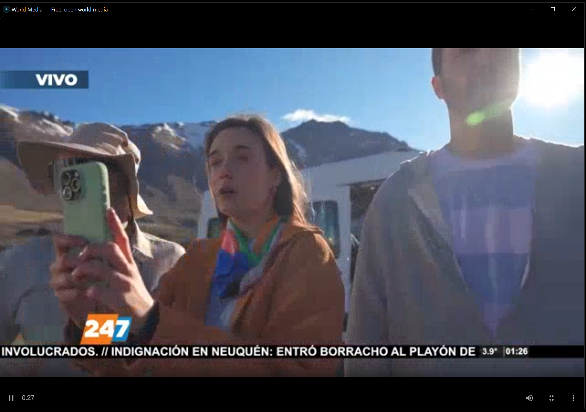

# World Media


**One desktop app for free, open world media — internet radio, live TV, public-domain video and audio.** Six open archives unified behind one search box. No accounts. No API keys. No telemetry. No installer. Double-click one `.exe` and it works.


### Install in two steps

1. Download **[World Media.exe](../../releases/latest/download/World.Media.exe)** (~86 MB) from the latest [Release](../../releases).
2. Double-click it.

First launch: ~10 seconds. The exe self-extracts into `%LOCALAPPDATA%\WorldMedia\`, imports a tiny pre-baked Ubuntu image into WSL2 (about 130 MB on disk), and opens. Every launch after: instant.

> **Heads up about dead channels.** Some IPTV streams and radio stations will be silent or refuse to connect. World Media doesn't host any content — it just points at the upstream stream. If a station hasn't broadcast in a week, or a TV channel has been pulled by its operator, you'll see a blank player or a connection error. Not a bug; the content moved. There are tens of thousands of working stations across the six sources; if one is dead, hit the next.

### What you get

Five tabs across the top: **Library**, **Tuner**, **Grid**, **Discovery**, **About**.

**Library** — search and browse everything. Left sidebar groups results by type (Radio / TV / Video / Audio) and by archive (Radio Browser / iptv-org / Internet Archive / NASA / Wikimedia Commons / LibriVox). Counts shown live as data loads in.


**Tuner** — skeuomorphic radio dial for live radio and live TV. Drag the dial or use arrow keys; each station gets a cosmetic frequency 87.5+ MHz.


**Library detail panel** — click any item to see metadata, license, source, and play it. NASA, Wikimedia Commons, LibriVox, and Internet Archive items have descriptions, license info, and a direct link to the source.


**Grid** — TV-guide-style tiles for live radio and live TV. Quick browsing by country and category.

**Discovery** — surprise me. Random item from a random enabled source.

**About** — what the app is, where each source's data comes from, privacy guarantees, license info, version.

### Playback

Video plays in a movable overlay; double-click the `[ ]` button for fullscreen.




### Where the content comes from

Every item World Media surfaces comes from one of six public, freely-accessible archives. The app does not host content. It does not require API keys for any of them.

| Source | What it provides | Home | Licensing |
|---|---|---|---|
| [**Radio Browser**](https://www.radio-browser.info) | ~40,000 internet radio stations | `radio-browser.info` | Stations retain their own broadcast rights |
| [**iptv-org**](https://iptv-org.github.io) | ~10,000 free-to-air IPTV channels | `iptv-org.github.io` | Stream operators retain their own rights |
| [**Internet Archive**](https://archive.org) | Millions of films, recordings, books | `archive.org` | Per-item — often public-domain or CC |
| [**NASA Image and Video Library**](https://images.nasa.gov) | Mission photos, videos, and audio | `images.nasa.gov` | Public-domain (US gov work) |
| [**Wikimedia Commons**](https://commons.wikimedia.org) | Free-licensed media files | `commons.wikimedia.org` | CC-BY-SA / public-domain per file |
| [**LibriVox**](https://librivox.org) | ~20,000 public-domain audiobooks | `librivox.org` | Public domain |

The About tab in the app shows the same list with each source's blurb and API endpoint.

### Privacy & isolation

- **No accounts.** Nothing to sign up for. The app has no server side.
- **No telemetry.** Doesn't phone home. Doesn't log usage.
- **No API keys.** All six sources are accessed through their public anonymous endpoints.
- **Same-origin proxy with allowlist.** A handful of sources (LibriVox, Wikimedia, occasionally Internet Archive) block direct browser requests for CORS reasons. A small Python proxy in the bundled Linux env forwards those — and *only* those — through a hard-coded host allowlist. Stream URLs (audio/video) are fetched directly, never proxied.
- **Sandboxed runtime.** All app processes run inside a private per-app WSL2 distro called `linbox-World_Media`. The host system sees only the launcher exe and the WebView2 window. Removing the app means `wsl --unregister linbox-World_Media` — nothing else leaks onto your machine.

### Requirements

- **Windows 10** (version 2004+) or **Windows 11**
- **[WSL2](https://learn.microsoft.com/en-us/windows/wsl/install)** installed (`wsl --install` from admin PowerShell if you don't have it). The exe checks for this on launch and shows a one-line install instruction if missing.
- **[Microsoft Edge WebView2](https://developer.microsoft.com/en-us/microsoft-edge/webview2/)** — pre-installed on Windows 11 and most Windows 10 machines since 2022. The exe also checks for this and tells you where to grab it if missing.
- ~200 MB free disk space (86 MB exe + ~130 MB extracted runtime)
- Internet for the upstream archives — World Media is a thin client over the open web.

### How it works (60 seconds)

```
World Media.exe (Windows host, 86 MB)
    ▼ self-extracts to %LOCALAPPDATA%\WorldMedia\ on first run
    │
    │ then spawns the inner launcher:
    ▼
┌────────────────────────────────────────────────────────────────┐
│ %LOCALAPPDATA%\WorldMedia\World Media.exe                      │
│  (linbox launcher, ~325 KB)                                    │
│  1. imports linux/rootfs.tar.gz as WSL distro `linbox-World_Media`
│  2. setup.sh sees the pre-baked /opt/app/.setup-complete stamp │
│     and short-circuits — no apt-get, no internet needed        │
│  3. start.sh launches server.py on port 9123 inside the distro │
│  4. opens a WebView2 window pointed at http://<wsl-ip>:9123/   │
└────────────────────────────────────────────────────────────────┘
    │
    ▼
┌────────────────────────────────────────────────────────────────┐
│ WSL2 distro `linbox-World_Media` (Ubuntu 24.04 + Python 3.12)   │
│  /opt/app/server.py     ← static frontend + CORS-bypass proxy  │
│  /opt/app/frontend/     ← built HTML/JS bundle                 │
└────────────────────────────────────────────────────────────────┘
```

### Folder structure (after extraction)

```
%LOCALAPPDATA%\WorldMedia\
├── World Media.exe              # Linbox launcher (the actual entry point)
├── webview.dll                  # Microsoft WebView2 loader
├── app.ico / app.json           # Icon + window config
├── icon.png                     # 1024×1024 source icon
│
├── bridge.py                    # /api/live + /api/shutdown HTTP handler
├── bridge_watchdog.py           # Restarts bridge.py if it dies
├── server.py                    # Static-file server + CORS-bypass proxy
│
├── setup.sh                     # First-run install (short-circuits via stamp file)
├── start.sh                     # Launches server.py inside the distro
├── stop.sh                      # Clean shutdown
├── sync-frontend.sh             # Dev helper to rebuild the JS frontend
│
├── frontend/                    # Built Vite bundle (HTML/CSS/JS)
│
└── linux/
    ├── rootfs.tar.gz            # 42 MB Ubuntu rootfs (python3 + ca-certs baked in)
    ├── rootfs.setup_hash        # Setup hash for "needs re-install?" detection
    ├── ubuntu-base.tar.gz       # Generic 29 MB Ubuntu base (fallback)
    ├── bzImage                  # x86_64 kernel (for QEMU/WHPX backends)
    ├── initramfs.cpio.gz        # Alpine initramfs (for QEMU/WHPX backends)
    ├── bbl64.bin                # RISC-V kernel (for TinyEMU backend)
    └── rootfs-riscv64.ext2      # RISC-V rootfs (for TinyEMU backend)
```

The WSL distro state lives at `%LOCALAPPDATA%\WorldMedia\wsl\ext4.vhdx` and is generated by WSL on first import.

### Built on

World Media is packaged using the [portable-linux-in-a-box](https://github.com/aivrar/portable-linux-in-a-box) template — the same launcher technology behind [brave-origin-for-windows](https://github.com/aivrar/brave-origin-for-windows) and other portable Linux-on-Windows apps. The template auto-detects the best backend per host: WSL2 on Windows, QEMU on macOS, native on Linux.

### Build from source

Frontend lives in a separate tree (`E:\World_media_app\world-media` on the original dev machine). To rebuild and re-pack:

```bash
# In the frontend tree:
npm run build

# Sync into this repo's frontend/ dir + reinject the proxy bootstrap:
bash sync-frontend.sh

# Build the single shareable exe (in a sibling WorldMedia_Single tree):
# 1. 7-zip the WorldMedia_Linux/ directory into bundle.7z (excluding wsl/, cache/)
# 2. cargo build --release in launcher/
# 3. pack.ps1 concatenates launcher exe + bundle + 16-byte trailer
```

The single-exe build script and Rust bootstrap launcher live in the `WorldMedia_Single` sibling directory (not in this repo — they're packaging infrastructure).

### License

MIT — see [LICENSE](LICENSE). Content from the listed sources retains its original license; check each item's source link for specifics.

### Credits

- The six archives above for making their catalogs freely available.
- [portable-linux-in-a-box](https://github.com/aivrar/portable-linux-in-a-box) for the launcher template.
- [hls.js](https://github.com/video-dev/hls.js) for HLS playback (vendored).
- [Tauri](https://tauri.app/) — the original frontend was a Tauri build; this distribution swapped it for a portable Linux env so the same code runs identically on Windows / macOS / Linux.
